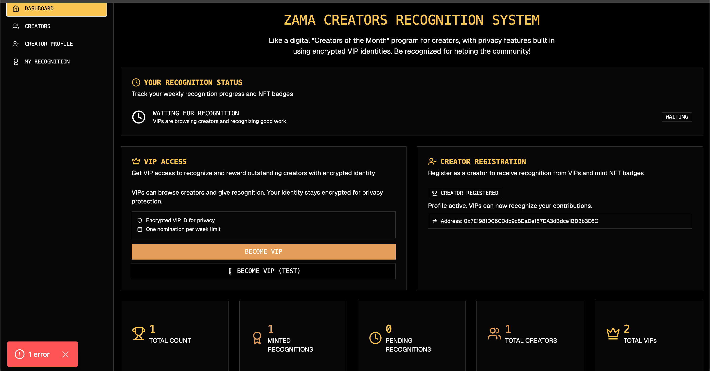
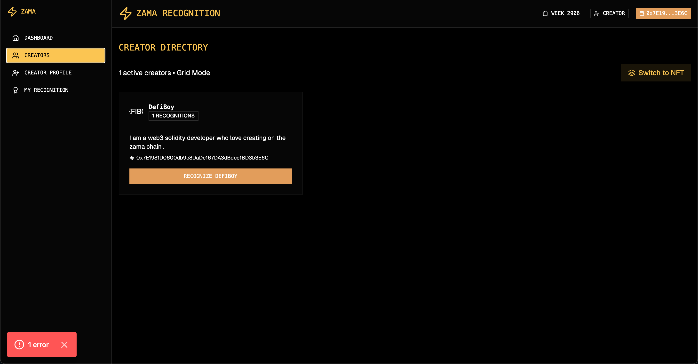
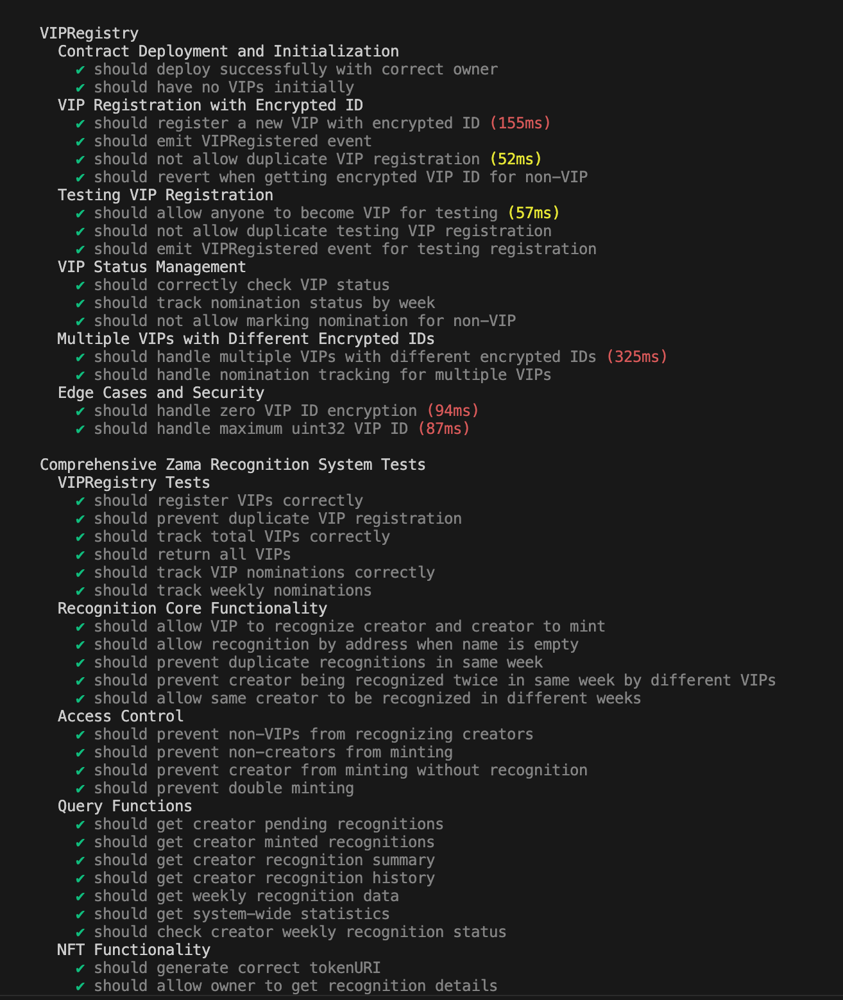
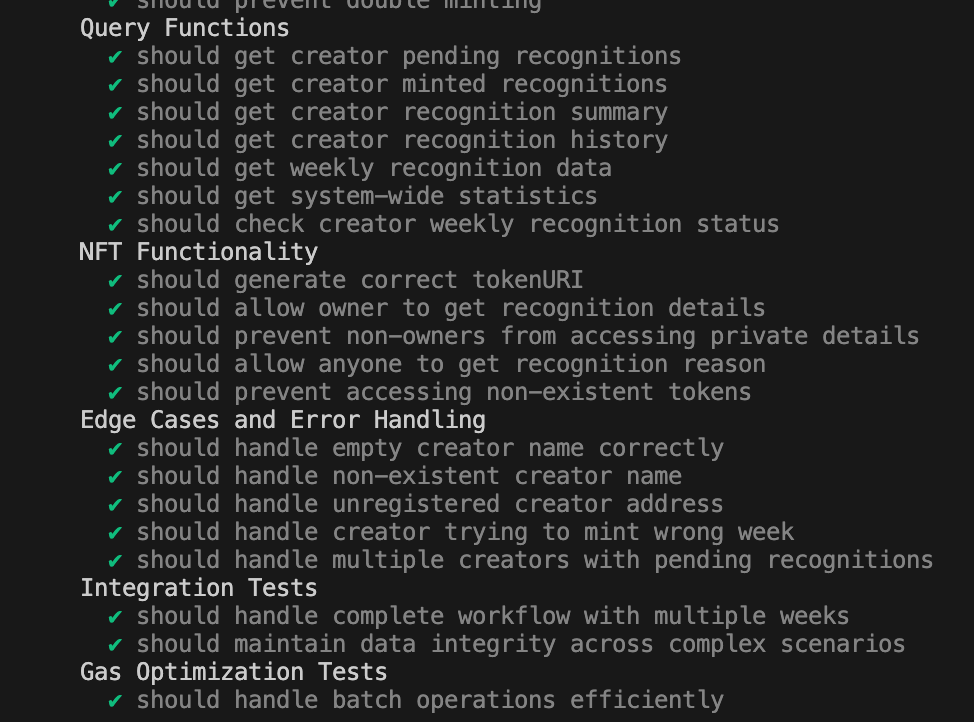
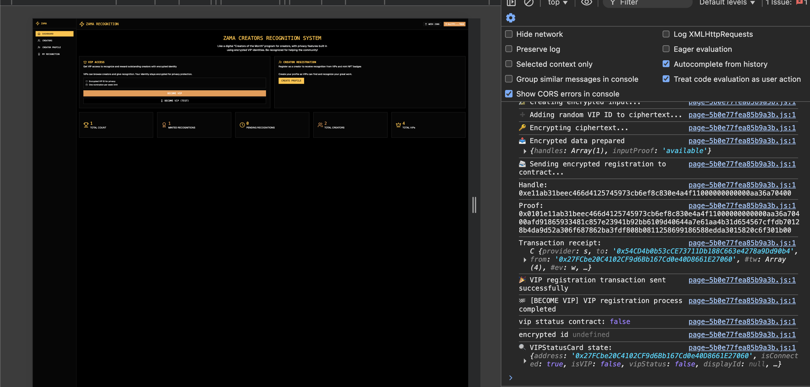

# Zama Recognition

**Built by:** Godspower Ufot  
**Stack:** Next.js (frontend), Zama blockchain (smart contracts), Ethers.js/Hardhat (deploy & tests)  
**Purpose:** A privacy-first recognition system for creators on the Zama blockchain. VIP nominators are encrypted so creators can see that they were nominated while protecting VIP identity to reduce online harassment.

---

## Table of Contents

- [Project Overview](#project-overview)
- [Core Features](#core-features)
- [How It Works](#how-it-works)
- [Contracts & Deployment Summary](#contracts--deployment-summary)
- [Screenshots](#screenshots)
- [Getting Started (Run Locally)](#getting-started-run-locally)
- [Security & Privacy](#security--privacy)
- [Developer Notes & Contract Details](#developer-notes--contract-details)
- [Future Work / V2 Wishlist](#future-work--v2-wishlist)
- [VIP Criteria — Request to the Zama Body](#vip-criteria--request-to-the-zama-body)
- [Contributing](#contributing)
- [License](#license)
- [Contact](#contact)
- [Zama YT Video](https://youtu.be/asDzOauM9fI)

---

## Project Overview

Zama Recognition is a blockchain-powered recognition system aimed at rewarding and recording creator achievements on the Zama chain. The key privacy-preserving innovation is that VIP nominators are **encrypted** before being recorded so creators can verify nominations while the VIPs' identities remain protected from public exposure, helping to reduce online harassment or targeted attacks.Watch the video here [Zama YT Video](https://youtu.be/asDzOauM9fI)
Creators can:

- Create and manage a profile
- See recognition history & stats
- Mint recognition records as NFTs
- Share recognition cards externally (e.g., on X)

VIPs can:

- Become a VIP (test flow available "Become VIP")
- Nominate creators with a reason (encrypted)
- Their nomination is recorded and can be verified by creators but not publicly exposed

---

## Core Features

- **VIP Encryption:** VIP addresses are encrypted before being stored; the system maintains verifiable recognition without exposing VIP identity.
- **Creator Profiles:** Creators create profiles and check their recognition stats and history.
- **Recognition NFTs:** Creators can mint recognized nominations as NFTs for provenance & sharing.
- **Dashboard:** Creator dashboard shows recognition history and aggregate stats (e.g., total recognitions, most frequent nominators — anonymized, top reasons, etc.).
- **Become VIP (test mode):** A testing flow to register as VIP (fhevm based) and verify nomination flows.
- **On-chain Storage:** Recognition records recorded to Zama blockchain contracts.
- **Admin / Future:** V2 will include more curated VIP-eligibility criteria.

---

## How It Works

1. **VIP Signup (Become VIP - test):**

   - VIP calls `becomeVIP()` (test) which encrypts their address and stores an encrypted VIP proof in `VIPRegistry`.
   - VIP can now nominate creators.

2. **Nomination:**

   - VIP nominates a creator using the UI → UI encrypts VIP identity/address and submits nomination with `reason`.
   - Smart contract stores the nomination referencing an encrypted VIP token/identifier.

3. **Creator Actions:**

   - Creator logs in, views recognition history (pulls on-chain recognition records).
   - Creator may mint a recognition record as an NFT via `ZamaRecognitionMain`.

4. **Dashboard:**
   - Aggregates stats from `CreatorRegistry` and `ZamaRecognitionMain` to display outcomes.

---

## Contracts & Deployment Summary

| Contract Name       | Status   | Address / Tx Hash                                                                                                          |  Gas Used |
| ------------------- | -------- | -------------------------------------------------------------------------------------------------------------------------- | --------: |
| VIPRegistry         | reused   | `0x54CD4b0b53cCE73711Db188C663e4278a9Dd90b4`                                                                               |         - |
| CreatorRegistry     | deployed | `0xF96f06489c2136C89D1Bca3A0B84372BCB34c8ce`<br>(tx: `0x296c4bfd28efb3d0815533dac6a7353cda6ef6f65bbf465459e193673ed14b46`) |   899,122 |
| ZamaRecognitionMain | deployed | `0xc0ccA917853A15EABd54F2BEb01Ca72dfafB38d1`<br>(tx: `0xa6a19c24e379a8bc4e774dfcc61e22fb456fa8a928ac23642320009cdb30877a`) | 3,051,931 |

> Table built by: **Godspower** — Next.js frontend + Zama Blockchain contracts.

---

## Screenshots

### Dashboard Overview



### 🔹 Creator Dashboard

Creators can track recognition history, see stats, and mint recognitions as NFTs.  


### 🔹 View All Creators



### Test screenshot




## encryption proof using zama

## 

## Getting Started (Run Locally)

1. Clone the repository:

   ```bash
   git clone https://github.com/godspowerufot/zama-recognition.git
   cd zama-recognition
   ```

2. Install dependencies:

   ```bash
   npm install
   ```

3. Run the development server:

   ```bash
   npm run dev
   ```

4. Deploy contracts:
   ```bash
   npx hardhat run deploy/deploy.ts --network zama
   ```

---

## Security & Privacy

- Encrypted VIP addresses prevent harassment or retaliation.
- Only creators can see that they were nominated, without VIP exposure.
- On-chain recognition ensures transparency and immutability.

---

## Developer Notes & Contract Details

- **Frontend:** Next.js (with ethers.js integration).
- **Smart Contracts:** Hardhat + Zama blockchain environment.
- **Testing:** Hardhat tests cover VIP registration, creator recognition, and NFT minting.
- **Deployment:** See `contracts/deploy/deploy.ts` for deployment scripts.

---

## Future Work / V2 Wishlist

- Add **stricter VIP criteria** (community/governance validation).
- Recognition badges with **tiers/levels**.
- Creator leaderboard and **social graph integration**.
- Integration with **X (Twitter) API** for seamless sharing of recognition NFTs.

---

## VIP Criteria — Request to the Zama Body

Currently, anyone can become a VIP (testing purpose).
For V2, I propose that the Zama governing body help define:

- Minimum on-chain activity threshold
- Governance participation history
- Community contribution metrics
- Possible KYC/verification for high-tier VIPs

This will help ensure the system is credible and harder to game.

---

## Contributing

Contributions are welcome! Please fork the repo and open a PR with improvements.

---

## License

This project is licensed under the MIT License.

---

## Contact

👤 **Godspower Ufot**

- Twitter/X: [@ufotgodspower8](https://x.com/ufotgodspower8)
- GitHub: [godspowerufot](https://github.com/godspowerufot)

---
